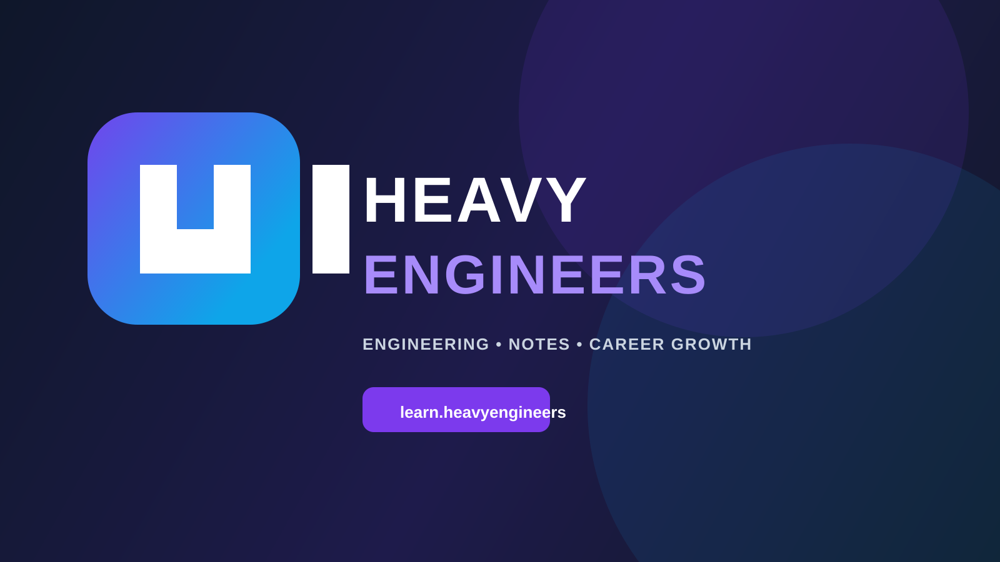

# Heavy Engineers

<div align="center">
  

  <p>
    <a href="https://heavyengineers.github.io/">
      
    </a>
    <a href="https://github.com/heavyengineers/heavyengineers.github.io/actions/workflows/deploy-pages.yml">
      
    </a>
    
  </p>

  <p>
    <strong>Engineering learning for students and professionals who want clarity, practice, and momentum.</strong>
  </p>
</div>

Heavy Engineers is a modern learning platform focused on helping people build strong engineering fundamentals through structured courses, revision notes, downloadable resources, and mentorship-oriented support.

## Live site

https://heavyengineers.github.io/

## Why this project exists

Heavy Engineers was created to make engineering learning more usable, structured, and practical. The site helps learners:

- understand core engineering concepts clearly
- stay consistent with focused study systems
- access quick PDF notes and learning resources
- prepare for interviews, exams, and real-world application

## Highlights

- Premium landing page for a modern learning brand
- Multi-page static website for courses, notes, about, and contact
- Downloadable study resource PDFs
- responsive design for mobile and desktop
- GitHub Pages deployment with a working deployment workflow

## Repository structure

```text
.
├── .github/
│   ├── ISSUE_TEMPLATE/
│   │   ├── bug_report.md
│   │   ├── config.yml
│   │   └── feature_request.md
│   ├── assets/
│   │   └── repo-banner.svg
│   └── workflows/
│       └── deploy-pages.yml
├── assets/
│   ├── favicon.svg
│   └── heavy-engineers-logo.svg
├── downloads/
│   ├── engineering-foundations.pdf
│   ├── problem-solving-guide.pdf
│   └── exam-notes-kit.pdf
├── about.html
├── contact.html
├── courses.html
├── index.html
├── notes.html
├── script.js
├── styles.css
├── LICENSE
├── README.md
├── CONTRIBUTING.md
├── CODE_OF_CONDUCT.md
├── .gitignore
└── .nojekyll
```

## Featured courses

### Engineering Foundations
- Ideal for new learners
- Covers core engineering thinking and fundamentals
- Includes downloadable notes and structured learning path
- Price: ₹2,999

### Problem Solving Mastery
- Great for revising and applying concepts systematically
- Includes practice-based guidance and reasoning frameworks
- Price: ₹4,499

### Career Launch Kit
- Designed for interview prep and career growth
- Includes study flow, notes, and action-oriented planning
- Price: ₹3,799

## Local development

```bash
cd heavyengineers.github.io
python3 -m http.server 8000
```

Then visit:

```text
http://localhost:8000
```

## Deployment

This project is deployed to GitHub Pages using the workflow in `.github/workflows/deploy-pages.yml`.

```bash
git add .
git commit -m "Update site"
git push origin main
```

GitHub Actions handles the deployment automatically after push to `main`.

## Contributing

We welcome improvements, bug fixes, and feature ideas.

Please read the project guidelines in [CONTRIBUTING.md](CONTRIBUTING.md) and the code of conduct in [CODE_OF_CONDUCT.md](CODE_OF_CONDUCT.md).

## Contact

For business inquiries, partnership opportunities, or course-related questions:

- Email: ayushnandanwar003@gmail.com
- Website: https://heavyengineers.github.io/

## License

This project is licensed under the MIT License. See [LICENSE](LICENSE) for details.
